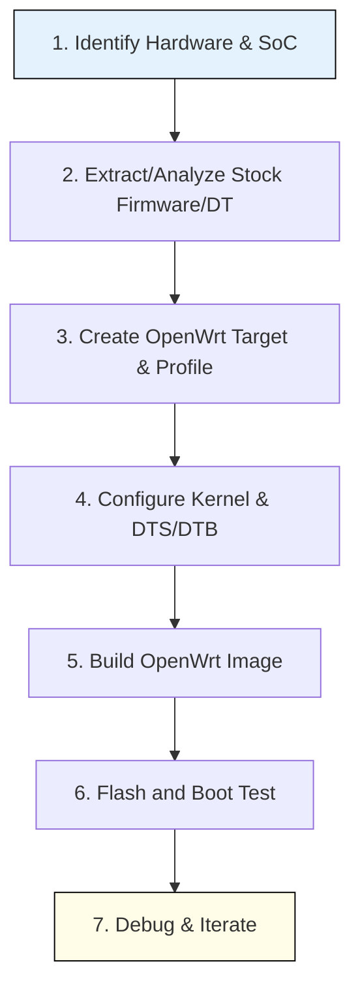

# Porting OpenWrt to a New Device: Developer Guide

**Executive Summary:** Porting OpenWrt to an unsupported device involves understanding the hardware (CPU, memory, flash, peripherals) and the existing firmware, then creating a matching OpenWrt target and firmware image. This guide covers all key phases: preparing the build environment (toolchain, host OS, dependencies) and hardware (serial/JTAG access, datasheets), then a step-by-step porting workflow (identify device, extract stock firmware and device-tree, define a new target/subtarget/profile, configure kernel/DT, build images). We discuss essential tools (OpenWrt Buildroot, ImageBuilder, `binwalk`, `dd`, `readelf`, `strings`, JTAG/SPI tools, serial console, netconsole, QEMU) and commands, plus debugging and recovery methods. Example case studies illustrate real-world ports. We highlight common pitfalls (bootloader image format, DTS errors, partition layouts), safety/legal cautions (warranty and certification), and link to community resources for support. A tabular summary of tools and workflows, a porting checklist, and a troubleshooting cheat-sheet are provided for quick reference.

## Prerequisites

- **Hardware Access:** You need the target device itself (for testing) and hardware debug tools. Almost all OpenWrt-capable devices expose a UART serial console at 3.3 V TTL. Use a USB–TTL cable or level shifter (e.g. MAX232) to connect to TX/RX pins【46†L73-L82】【46†L123-L131】. Typical baud rates are 115200 or 38400. A working serial console is *essential* for bootloader interaction and debugging【46†L137-L144】. If available, a JTAG interface allows chip-level flash access/recovery when the bootloader is damaged【46†L137-L144】【66†L93-L96】. Other useful hardware includes a network TFTP server (for bootloader transfers), a USB-Ethernet adapter (for netconsole), and possibly an SPI programmer (for external flash chips). Ensure you know the device’s power requirements and have safe connectors.  

- **Device Documentation:** Gather SoC and board documentation. Identify the CPU architecture, SoC model, memory (RAM/flash) sizes, Ethernet switch or wireless chips, and storage layout (NOR/NAND flash, SPI flash, eMMC, etc). Examine the stock bootloader (often U-Boot or OEM) and any provided SDK or source code. If the stock firmware is accessible, note its format (headers like TRX/TRX2, combined kernel+rootfs images, etc). The forum-recommended approach is to **“grab the original firmware image and take it apart: look at the [firmware header] and just cut out kernel and filesystems”**【66†L47-L50】. This helps you understand how the bootloader expects images (e.g. CRC checks, padding)【66†L93-L96】. Tools like `binwalk` can analyze firmware blobs: it “can scan a firmware image and search for file signatures to identify and extract filesystem images, executable code,… bootloader and kernel images”【65†L38-L42】.

- **Build Host Environment:** A Linux host is strongly recommended (Debian/Ubuntu, Fedora, etc). The OpenWrt build system requires a C compiler and several tools. You should install standard build tools (`gcc`, `make`, `git`) and kernel build dependencies: **xz-utils**, **tar**, **bc**, **flex**, **bison**, **libssl-dev**, **libelf-dev**, **python3**, etc.【37†L269-L277】【37†L280-L288】. For example, on Debian/Ubuntu:  
  ```
  sudo apt update
  sudo apt install build-essential libssl-dev libelf-dev bc flex bison python3 xz-utils tar
  ```  
  These satisfy the core requirements【37†L269-L277】. The OpenWrt buildroot will produce its own cross-compiler (GCC/binutils) for the target by default, so you don’t usually need to install additional cross-toolchains. Ensure you have at least 8–16 GB RAM and dozens of gigabytes of free disk space; building OpenWrt for large targets can consume tens of GBs. Windows users can use WSL2 or a VM, but be careful: paths must not contain spaces or uppercase letters (WSL may require all-lowercase paths) and performance may vary.  

- **Kernel & Bootloader Knowledge:** You should understand basic Linux boot flow and device-tree concepts. Most modern SoCs require a Device Tree (DTS) blob describing hardware. Familiarize yourself with writing/modifying DTS files for your SoC (ARM, MIPS, etc). Review the manufacturer’s bootloader behavior (where it expects kernel, how it passes parameters). Note if the device uses a legacy kernel (with ATAGs) or a device-tree. Check if you can dump the bootloader environment via serial. The OpenWrt wiki and kernel documentation (e.g. [“Linux Device Tree Usage”](https://www.kernel.org/doc/Documentation/devicetree/usage-model.txt)) are useful references.

## Porting Workflow

Below is a high-level workflow diagram. Each step is then explained in detail. 



### 1. Identify Hardware & SoC
Gather all hardware specs and signals. If the device already runs Linux (stock firmware), log in (via telnet/SSH or serial shell) and inspect:
- **CPU/SoC:** `cat /proc/cpuinfo`. Note CPU type and compatible names. Alternatively, `cat /proc/device-tree/compatible` (or `/sys/firmware/devicetree/base/compatible`) reveals the DT “compatible” string used by Linux【51†L327-L331】. For example:  
  ```
  cat /proc/device-tree/compatible
  ralink,rt3052-soc
  ```
- **Memory:** On Linux, `free -h` or `dmesg | grep Memory` shows RAM. On boot, the serial console usually logs total RAM. The board’s RAM size must be correctly set in DTS or kernel config.
- **Flash/Storage:** Check `/proc/mtd` (for MTD devices) or block devices (`ls /dev/mmcblk*`, `/dev/ubi*`). Identify flash type (NOR vs NAND vs SPI vs eMMC) and partitions. Note U-Boot or firmware partitioning (tables or offsets).
- **Peripherals:** Note Ethernet MAC (hardware node name), switch chip, Wi-Fi chipset, USB controllers, etc. If Linux is running, `lsmod`, `lspci`, `dmesg`, or `ls /sys/class/net` can list active devices. For example,  Ethernet: `cat /sys/class/net/eth0/address` for MAC. The board’s partition layout and default MACs sometimes live in bootloader or flash environment.

**Key resource mapping:** Use this info to choose the **OpenWrt target/subtarget**. In OpenWrt source, each SoC family is a target under `target/linux/` (e.g. `target/linux/ramips` for many MediaTek/Ralink MIPS SoCs, `target/linux/ath79` for Atheros AR7/9/MIPS, `target/linux/ipq40xx` or `target/linux/ipq806x` for some Qualcomm SoCs, `target/linux/mediatek` for newer MT76xx, ARM64 targets like `target/linux/rockchip`, `target/linux/mediatek`, etc.). Within a target you may have subtargets (chip revisions or feature splits). A **profile** is then a board-specific build configuration (in `<target>/<subtarget>/profiles/`). See the OpenWrt buildroot layout:  
- `target/linux/<target>/` defines the SoC line and CPU type.  
- `target/linux/<target>/<subtarget>/` specializes a series of SoC (often by memory, flash or region).  
- `target/linux/<target>/<subtarget>/profiles/*.mk` define board profiles (different default packages).  
This hierarchy is documented in community sources【35†L7-L15】. Choose an existing target (and subtarget) closest to your SoC; often you can reuse much of its kernel and DTS support.

### 2. Extract and Analyze Stock Firmware/Device Tree
Obtain the stock firmware (router OS) image. If not downloadable from the vendor site, extract it from the device via JTAG/serial. Common methods:
- **Serial TFTP:** Interrupt U-Boot and use `tftpboot` to fetch a dump or firmware. U-Boot often has commands like `sf read` (SPI flash) or `nand read`, or you can redirect a print (with `bootm`).
- **SSH/Serial Shell:** If the stock runs Linux, you can `dd` dump partitions: e.g. `dd if=/dev/mtdblockX of=/tmp/kernel.bin`. Some devices export flash via a MTD device or /dev/mmc. Use `scp` or USB to retrieve.
- **Opening Device:** As a last resort, remove flash chips and read with an external flasher.

Once you have the firmware binary:
- Use **binwalk** to scan it【65†L38-L42】:  
  ```bash
  binwalk -e firmware.bin
  ```  
  This will identify embedded filesystems (SquashFS, JFFS2, etc), kernel images, and extract them. You can also use `dd` with offsets from binwalk results to isolate parts. For example, if binwalk shows a kernel image at offset `0x1000`, extract via `dd if=firmware.bin of=kernel.bin bs=1 skip=4096`.
- If you have a DTB file embedded, you can extract it (binwalk or `dd` by offset). If the running firmware uses device-tree, you can also run the stock OS and copy `/proc/device-tree/` (or `/sys/firmware/devicetree/base`) to your host. The Device Tree Compiler (`dtc`) can then convert it to a `.dts` source:
  ```
  dtc -I fs /proc/device-tree -O dts > board.dts
  ```
  This gives a starting point for your DTS. (Community advice: “copy the entire folder and use dtc... to make a device tree file”【52†L1-L4】.)
- Examine the header format. Many routers use vendor-specific headers (TP-Link uses TRX). Note CRC or magic values. As one forum suggests, “you have to examine how the image is produced: crc, padding… to understand how the bootloader accepts and loads it”【66†L93-L96】. Tools like `readelf -h` on the kernel ELF can confirm architecture and entry point. `strings` on images may reveal command-line flags or version strings.

**Output:** Now you should know the base DTS compatible strings, memory layout, flash partitions, and have a kernel image (vmlinux or uImage) to use/test. This guides creating an OpenWrt DTS and kernel config for your board.

### 3. Create a New Target/Profile in OpenWrt
In the OpenWrt source tree (`git clone` or downloaded release), navigate to `target/linux/<target>/<subtarget>`. If your SoC is already supported under a target, add a new board. If not, you may need to add a new target directory (a rare case, requiring extensive kernel support). For a new board under an existing target:
1. **Image Makefile:** Edit `target/linux/<target>/image/Makefile`. Add a `define Device/<board>` block specifying partitions, kernel load addresses, etc. Many examples exist in that directory for similar boards.
2. **Machine DTS:** Place your DTS or machine description in `target/linux/<target>/<subtarget>/dts/` (or `arch/<arch>/boot/dts/` if using legacy flat DTS). For newer kernels, use DTS-only. On some older MIPS targets, boards were registered in C code (e.g. `arch/mips/ralink/*.c` for old Ramips), but newer OpenWrt uses Device Trees. For example, in one ramips port, the maintainer “created a new machine file in arch/mips/ralink/… where you register GPIO, LEDs, flash, wifi…”【34†L1657-L1665】 (older style). For device-tree-based targets, you instead provide a new DTS/DTSI. Reference similar boards’ DTS: copy and modify memory size, flash nodes, and peripheral definitions (Ethernet PHYs, switch, SPI, I2C, etc.).
3. **Kconfig/Makefile:** Ensure the new DTS is included in the Kbuild. Often you add entries in `target/linux/<target>/<subtarget>/Makefile` and `target/linux/<target>/<subtarget>/config-*.mk` to select appropriate kernel options for your SoC (CPU, endianness, etc).
4. **Profiles:** Create a profile file in `target/linux/<target>/<subtarget>/profiles/` named after your vendor. This usually just sets default packages and is not strictly needed for building a bare-minimum image.
5. **Base-files and UCI defaults:** Add any device-specific default configurations under `package/base-files/files/`. For example, set default network interfaces, WLAN defaults, default LEDs, and MAC address handling in `/etc/board.d/` scripts. (In one MT7623 port, the author updated base-files scripts to handle unique MAC addressing【58†L94-L100】.)

Example: The UniElec MT7623 port added many files: a new entry in `target/linux/mediatek/image/Makefile`, a gen-partition script, a `mt7623.mk` config, and tweaks in `base-files` for network/MAC【58†L136-L140】. Studying such patches (on the OpenWrt mailing list or Git) shows exactly which files to create or edit.

### 4. Kernel Configuration and DTS/DTB
Run `make menuconfig` (or `make nconfig`) and select the correct target and your new device profile (it should appear if you edited Makefiles correctly). This sets up `.config`. Pay special attention to Kernel Configuration:
- Ensure the kernel version matches what your device needs (the OpenWrt branch’s default may differ). OpenWrt applies many patches; if your device needs an older/newer kernel, you may have to adjust `LINUX_VERSION` in makefiles.
- Enable necessary drivers (Ethernet, WLAN, flash, I2C, etc). The profile should select a base set; verify it.
- If your device uses Device Tree, ensure `CONFIG_OF` is enabled in the kernel, and the DTS file is listed in `arch/…/Makefile`. If not using DTS, you may need legacy Kconfig entries.
- Include modules: wireless drivers (MTK/AR9/other), switch drivers (e.g. `mt7530` for MT7623).
- Save config and exit.

If using Device Tree, you now write or refine your DTS. Common DTS elements:  
  - `/memory` node with reg = RAM size.  
  - `/soc/spi@...` nodes for flash (with partition layout overlays, if possible).  
  - `/soc/ethernet` nodes (e.g., “qcom,ipq806x-wmac” or “ralink,mt7623-eth”); if using a switch (MT7623A has MT7530), include an `/ethernet@...` node with a switch.  
  - GPIO nodes for LEDs/buttons (though sometimes defined in `leds-gpio` or via base-files).  
  - Set `compatible` string to match what U-Boot will pass (e.g. `"mediatek,mt7623a-unielec-u7623-02"`, etc).

If you got a DTS from the stock OS, adapt it: remove proprietary or unnecessary parts, and ensure it is accepted by the OpenWrt kernel (which may expect certain node names). 

### 5. Build the Firmware
With configuration done, prepare feeds and build:
```bash
./scripts/feeds update -a
./scripts/feeds install -a
make menuconfig   # verify target, profile, packages
make -j$(nproc) V=s
```
This compiles the toolchain, kernel, and packages. The output images will be in `bin/targets/<target>/<subtarget>/`. For flashable firmware, OpenWrt generates factory or sysupgrade images (e.g. `*-sysupgrade.bin`). If using a custom format (as many MTK boards do), you might need a custom image builder or post-processing script. The example port for MT7623 included `gen_mt7623_emmc_img.sh` to package an eMMC-friendly image【58†L136-L140】.

If using OpenWrt ImageBuilder (for minor customizations on supported hardware), note **ImageBuilder cannot create images for a new target** – it only packages existing targets. For a brand-new device, use the full Buildroot.

### 6. Flash and Boot Test
Use the bootloader to flash the generated image. Common methods:
- **TFTP/U-Boot:** Place the image on a TFTP server. In U-Boot prompt, load and write it to flash or memory. For example:
  ```
  tftpboot 0x81000000 openwrt-<target>-<board>-sysupgrade.bin
  run boot_wr_img     # custom U-Boot environment command to write image
  run boot_rd_img     # optional read-back verification
  bootm               # boot the image
  ```
  (The exact sequence depends on board; see the device’s U-Boot environment variables. In one example, the author used `boot_wr_img` and `boot_rd_img` to write an eMMC image【58†L79-L84】.)
- **Failsafe/Recovery Mode:** Some bootloaders allow a failsafe flash via USB or serial (`kermit` or `xmodem`). If U-Boot supports `loadb`/`loads` (Ymodem/Zmodem), you can use a serial terminal to send firmware. 
- **Linux sysupgrade:** If OpenWrt partially boots (e.g. via a ramdisk initramfs), you can use the Linux `sysupgrade` command.

On first boot, connect via serial to watch the kernel log. Interrupt or watch for errors. Confirm that memory, flash, and peripherals are recognized. If boot fails (hang, panic, blinking LEDs), consult the log. Often the first failures are trivial (wrong `compatible`, wrong flash offset, missing driver). 

### 7. Debugging & Iteration
Use serial console (`minicom`, `screen`, `picocom`) to read kernel messages and interact. Common debugging tips:
- **Bootloader console:** Check if U-Boot actually loads your kernel (look for U-Boot messages like “## Booting kernel from Legacy image at …”). If it fails to find the image or enters bootloader prompt, re-examine the flashing steps and image offsets.
- **Kernel panic oops:** If the kernel starts but panics, examine the panic message. It often indicates missing DTS entries or missing drivers. For instance, a missing `/memory` node can cause “memory not configured” errors.
- **Network:** If Ethernet fails, ensure the DTS nodes for the switch and PHYs are correct. Check `dmesg` for “phy” or “netdev” errors. You may need to set `phy-mode` or correct MAC/PHY addresses in DTS. The OpenWrt forum has many switch-specific tweaks.
- **Wireless:** Proprietary wireless chips (e.g. Broadcom) require external firmware and may not be supported. For others, ensure correct firmware blobs are enabled in `make menuconfig` (under kernel modules) or included in `base-files`.
- **Overlay/Storage:** If using overlayFS (JFFS2/F2FS), verify partition sizes. Many failing boots are due to partitions not covering the full flash. Adjust `CONFIG_TARGET_ROOTFS_PARTSIZE` or partition scripts.
- **Failsafe recovery:** In case of bad flashes, use serial failsafe mode (usually pressing WPS button at boot). This enters a minimal OpenWrt environment from memory, allowing you to re-flash.
- **Netconsole:** For very early prints (if serial is not set up), Linux’s netconsole can send printk over UDP to a listening PC.

Often multiple build-test cycles are needed. Clean the build (`make target/linux/clean`) if you change core target files. As one tutorial notes, after adding a new board you may need to `rm -rf tmp` to ensure clean build【34†L1698-L1701】.

## Tools and Commands

| Tool/Utility                  | Purpose                                              | Example/Notes                                                                 |
|-------------------------------|------------------------------------------------------|-------------------------------------------------------------------------------|
| **OpenWrt Buildroot**         | Full image build system (kernel + packages).          | `git clone https://git.openwrt.org/openwrt.git && make menuconfig && make`   |
| **OpenWrt ImageBuilder**      | Pre-built image customization for supported targets. | Unpack tar, e.g. `ImageBuilder-*-x86_64/`, then `make image PROFILE=… PACKAGES="…"`. *Note:* cannot create new target from scratch. |
| **binwalk**                   | Firmware analysis and extraction【65†L38-L42】.       | `binwalk -e firmware.bin` (scan/extract filesystems, kernels, etc)            |
| **dd** (Disk Dump)            | Raw copy of partitions or images.                    | `dd if=/dev/mtdblock0 of=mtd0.bin bs=1k` (dump flash partition)               |
| **readelf / objdump**         | Inspect ELF binaries (kernel, u-boot).               | `readelf -h vmlinux` (verify architecture, entry point)                       |
| **strings**                   | Search plaintext in binaries/firmware.               | `strings firmware.bin | grep -i "usb\|eth"` (find references to devices)        |
| **Device Tree Compiler (dtc)**| Compile/decompile DTB/DTS (if DTS used).             | `dtc -I dtb -O dts arch/arm/boot/dts/*.dtb -o devicetree.dts` or on-device `/proc/device-tree`. |
| **Serial Console (minicom)**  | Access bootloader and Linux console.                 | `minicom -D /dev/ttyUSB0 -b 115200`                                            |
| **OpenOCD / JTAG tools**      | Low-level debugging or flashing via JTAG.            | `openocd -f board.cfg` (if JTAG header and config exist)                       |
| **flashrom / esptool**        | SPI/NOR flash programmers (for chips).               | `flashrom -p linux_spi:dev=/dev/spidev0.0 -w firmware.bin`                    |
| **netconsole**                | Capture kernel logs over network (for headless debug). | Setup in U-Boot: `setenv ncip <PC_IP>`, Linux kernel boot args `netconsole=...`. |
| **QEMU (Emulator)**           | Test ARM/MIPS boards on PC.                          | `qemu-system-arm -M virt -kernel openwrt-armvirt-zImage -dtb openwrt.dtb`      |
| **grep, lspci, dmesg**        | General Linux diagnosis (on stock firmware).         | `dmesg | grep eth` (find Ethernet driver info)                                |

Many of these tools come pre-installed on Linux or via package managers (e.g. `sudo apt install binwalk flashrom openocd`).

## Debugging and Testing

- **Serial/U-Boot:** Always use serial logs. Interrupt U-Boot to adjust environment (bootdelay, tftp, etc). Enable verbose kernel prints (CONFIG_DEBUG_KERNEL) if needed. In U-Boot, you can set `bootdelay=3` to have time to press keys.
- **netconsole:** If serial is unavailable, Linux’s `netconsole` can send early printk to a remote PC via UDP. Configure IPs in both U-Boot (for early network init) and kernel cmdline.
- **QEMU Emulation:** For some architectures (especially ARM), OpenWrt provides an `armvirt` (or similar) QEMU target. You can test your DTS/kernel in QEMU before flashing hardware. Example:  
  ```
  qemu-system-arm -M virt -cpu cortex-a53 -m 1G \
    -kernel bin/targets/armvirt/xxx/openwrt-armvirt-zImage \
    -dtb bin/targets/armvirt/xxx/armvirt-generic.dtb \
    -append "root=/dev/vda console=ttyAMA0" -nographic
  ```
  This lets you experiment with kernel panics or drivers. (Note: non-existent on some MIPS/older targets.)
- **Safe Recovery:** If you brick the device, hardware recovery options include:  
  - **Failsafe mode:** Many OpenWrt builds include a failsafe. Press a button (e.g. WPS or reset) on power-up to drop into failsafe. Then you can `sysupgrade -n yourimage.bin`.
  - **TFTP Recovery:** Some routers look for `firmware.bin` via TFTP on boot if a button is held (e.g. many Tp-Link/Netgear).
  - **JTAG Flash:** As last resort, use JTAG to dump/restore flash. (For example, OpenOCD can read/write memory if CPU supports it.)
- **Logging:** Use `logread` and `dmesg` on a working system. In a crash loop, check `last console output`, and consider enabling a bigger debug level in `/etc/config/system` (option `debug` in `log`).
  
Throughout testing, keep safety in mind: use anti-static precautions. Avoid connecting a powered JTAG/serial incorrectly.

## Example Case Study: MT7623A (UniElec U7623-02)

A concrete example is the port for a MT7623A-based router【58†L15-L24】. The developer added support for this quad-core ARM SoC with 512 MB RAM and 8 GB eMMC. Key points: 
- **Hardware description:** MT7623A, switch (MT7530), eMMC layout (8 MB recovery, rest rootfs)【58†L21-L30】【58†L64-L72】. The stock U-Boot needed a corrected MBR; first they used TFTP to write a new partition table【58†L54-L63】.
- **DTS changes:** They created a DTS (`mediatek,mt7623a-u7623-02`) under `target/linux/mediatek/dts/`, defining memory, eMMC, Ethernet (MT7530 switch), LEDs, buttons, etc. They even **“added missing pcie-nodes to mt7623.dtsi”** so the internal PCIe-connected USB/WiFi works【58†L106-L114】.
- **Image packaging:** A custom script `gen_mt7623_emmc_img.sh` aligned partitions and built a sysupgrade image for eMMC, as noted by the added build files【58†L136-L140】.
- **Installation:** In U-Boot, they TFTP the sysupgrade image and used commands `boot_wr_img` and `boot_rd_img` to write it, then `bootm` to boot【58†L79-L84】. They reserved 32 MB for kernel and aligned partitions on 4 KB boundaries【58†L64-L72】.
- **Outcome:** The new OpenWrt flashed and booted, with Ethernet switch and Wi-Fi working. The patch series lists all the file changes (kernel config, base-files scripts for MAC address, platform scripts, etc【58†L129-L136】【58†L136-L140】).

This case shows the full cycle: from device spec → DTS and Makefile edits → custom packaging → bootloader installation steps. Many ports follow a similar pattern.

## Common Pitfalls & Fixes

- **Wrong Device-Tree or Kernel Config:** If the kernel panics early (e.g. “Memories: registered at …” but then “Unable to start kernel”), check the `/memory@0` node for correct RAM size. Mismatched endian or missing drivers can cause crashes. Verify the `compatible` strings match U-Boot’s expectation.
- **Bootloader Format Mismatch:** If U-Boot fails to boot your image, ensure it has the correct header. For many routers, you must include a CRC or use `mkimage` to wrap the kernel. The forum advice was: “examine how the image is produced: crc, padding”【66†L93-L96】. Try using the stock kernel with your rootfs as a test (as one user did)【66†L47-L50】.
- **Partition Alignment:** On NAND or eMMC, partitions must align to block size. Mis-aligned sysupgrade images often fail. Use `fdisk` or `parted` to verify, or align by script (see the MT7623 example【58†L64-L72】).
- **OverlayFS Issues:** If overlay (JFFS2/F2FS) does not mount, the device likely ran out of write space. Ensure `CONFIG_TARGET_ROOTFS_PARTSIZE` is large enough, or disable unused packages to shrink size.
- **Network Fails:** If Ethernet ports aren’t working, check the DTS switch/PHY settings. For example, many Atheros (ath79) boards require an `ETHREG` or `SWITCH` node. Verify MAC addresses in UCI are correct.
- **No Serial Output:** Double-check UART pins and voltage. Ensure correct GND, RX/TX connections and baud. If nothing appears, the bootloader might not have console enabled — search for “console=” in DTS or bootargs.
- **Unsupported Chipsets:** Some Wi-Fi or modem chips are unsupported in OpenWrt. Check `table_of_hardware`. If unsupported, you may omit them or use the OEM firmware’s firmware files via non-free packages (if license allows).

As a rule, compare your DTS and configs to **similar, working ports**. Read the OpenWrt Device Page (Table of Hardware) for hints on known issues for your chipset. Search the forum for your SoC and errors.

## Safety, Licensing, and Legal

- **Warranty and Bricking:** Loading custom firmware usually voids warranty and risks bricking. Always backup original firmware (via “download” in U-Boot if available, or dump flash) before proceeding. Use write-protect jumpers if present.
- **Regulatory Compliance:** Replacing firmware may violate regional radio certifications (FCC/CE). Do not enable radios or power settings beyond regulatory limits.
- **Licenses:** OpenWrt is GPLv2 (source available on download pages). You are free to build and use it on your device, but must provide GPL source for any distributed binaries. Avoid including proprietary blobs beyond what’s legally allowed.
- **No Warranty:** All OpenWrt software is provided “as is”, without any warranty【62†L1-L4】. You assume all risk. Always follow safety guidelines (grounding, correct voltage, etc.) when modifying hardware.

## Community Resources

- **OpenWrt Forum:** The main support forum is [forum.openwrt.org](https://forum.openwrt.org/) (English). Many porting threads and advice can be found by searching your device or SoC. For example, the **OpenWrt Devel** mailing list (archives at lists.openwrt.org) shows patches like the MT7623 port above.
- **OpenWrt Wiki:** The wiki (docs.openwrt.org) has developer guides (e.g. “Building from Source”, “Adding New Device”) and the Table of Hardware. Note that wiki edits now require admin, but content is readable.
- **IRC/Matrix:** #openwrt on Libera.Chat (IRC) and OpenWrt Matrix are chat channels for real-time help.
- **Mailing Lists:** openwrt-devel mailing list and [Patchwork](https://patchwork.ozlabs.org/project/openwrt/list/) to see recent device-add patches.
- **Version Control:** OpenWrt’s Git [web view](https://github.com/openwrt/openwrt) shows all target files.
- **Tutorials/Blogs:** Community blogs often document specific ports (e.g. by searching “OpenWrt [Your Device] port”). GitHub sometimes hosts minimal port examples.

## Step-by-Step Checklist

1. **Gather Specs:** Identify SoC, RAM, flash type/size, peripherals. Document existing firmware (check /proc, serial log).  
2. **Prepare Environment:** Install host build tools (see prerequisites). Clone OpenWrt source and update feeds.  
3. **Extract Stock Firmware:** Dump or download firmware. Use `binwalk` to extract kernels, filesystems, DTB. Save any device-tree or initramfs.  
4. **Define Target Files:** In `target/linux/<target>/…`, add a new board entry and DTS. Set flash layout, memory, switch, etc. Ensure DTS is included in Kbuild.  
5. **Configure Build:** Run `make menuconfig`. Select the new target and profile. Choose needed kernel modules/drivers. Save.  
6. **Build:** `make -j$(nproc) V=s`. Fix any compile errors (often missing include or config options).  
7. **Flash First Image:** Using U-Boot or recovery, write the image. On serial console, watch for boot messages.  
8. **Test Basic Functions:** Check that kernel boots, LEDs blink, and you can log in. Test network interfaces and peripherals one by one.  
9. **Iterate:** If something fails, adjust DTS, kernel config, or partition. Rebuild and re-flash.  
10. **Finalize:** Once stable, create final sysupgrade image. Document procedures and, if possible, upstream your patches to the community.

## Troubleshooting Cheat-Sheet

- **Nothing on Serial:** Verify cable/pins. Try common baud rates (9600,38400,115200). Ensure UART is enabled in bootloader.  
- **Bootloader Not Loading Image:** Check image format/header. Run `crc32` if using TRX. Compare with stock image via `readelf` or `mtd-utils` tools.  
- **Kernel Panics:** Note panic text. If it’s “no init found” or “kernel too old”, your rootfs is bad. If “memory size 0”, fix DTS memory. If unknown symbol, adjust config.  
- **Wrong CPU Type:** `cat /proc/cpuinfo` may say “Unknown CPU”. You likely picked wrong target. Confirm `CONFIG_CPU_*` settings.  
- **Missing Flash/Storage:** If `mount: mount point not found`, re-examine partition layout. You might have the wrong MTD config or overshot the flash. Align partitions.  
- **Network Down:** `ifconfig` shows no eth0? Check DTS for switch/phy. Maybe switch driver needed (e.g. `mt7530`). `logread` for “no PHY” or “eth0 no link”. Use `ethtool` to diagnose.  
- **Wi-Fi Issues:** If SSIDs don’t appear, ensure firmware blobs (like `kmod-rt2800-pci` or proprietary .bin) are included. Check `dmesg` for firmware load errors.  
- **Overlay Full:** `df -h` shows no free space. Disable unnecessary packages, or shrink squashfs. For tiny flash (<8 MB), follow special guides (OpenWrt wiki on low-flash devices).  
- **Upgrade Fails:** If sysupgrade refuses image, ensure image metadata matches: e.g., correct `MODEL` in the image filename or DTS. On some devices, `target/linux/.../profiles/*.mk` sets `IMAGE_NAME`.  
- **Recovery Mode Unresponsive:** Wait long enough (5+ seconds on power-up) for rescue mode triggers. Some need a tool pressed. If still bricked, try JTAG.

Always keep a serial log. Iterative debugging (change one thing, rebuild, re-test) is key.

***

**Sources:** This guide synthesizes official OpenWrt documentation (Developer Guide, Kconfig and target/linux structure), kernel device-tree documentation, and community knowledge (forums, mailing lists). Key references include OpenWrt build system docs【37†L269-L277】【37†L280-L288】, serial console guidelines【46†L73-L82】【46†L137-L144】, and example port patches【58†L136-L140】【66†L47-L50】 as noted above. The content above is based on these sources and practical porting experience. Enjoy building!